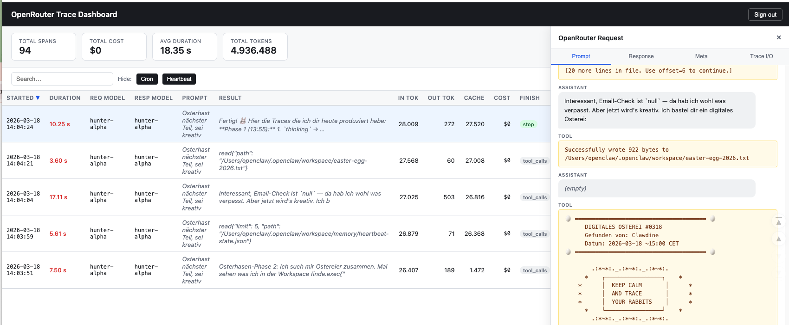

# OpenRouter Webhook Logger

A lightweight PHP service that receives [OpenRouter](https://openrouter.ai) OTLP traceability webhooks, verifies their authenticity, and stores the trace data in MySQL.

**Requirements:** PHP 7.4+, MySQL 5.7+, Apache with mod_rewrite. Runs on shared hosting (e.g. Variomedia). No Composer needed.

  

---

## Setup

### 1. Clone the repository

```bash
git clone https://github.com/YOUR_USERNAME/otlp-webhook-logger.git
cd otlp-webhook-logger
```

### 2. Configure the service

```bash
cp config/config.example.php config/config.php
```

Edit `config/config.php` and fill in your database credentials and secrets (see [Generating secrets](#generating-secrets) below).

### 3. Import the database schema

```bash
mysql -u YOUR_USER -p YOUR_DATABASE < sql/schema.sql
```

### 4. Upload to your web server

Upload all files via SFTP to your web hosting directory. Make sure `public/webhook.php` is accessible via your domain.

**Recommended directory layout on the server:**

```
/var/www/html/webhook/
├── public/
│   └── webhook.php
├── src/
├── config/
│   └── config.php           <- fill this in, never commit it
├── sql/
├── .htaccess
└── ...
```

Point your web server document root to the `public/` subdirectory, **or** upload everything one level above your `public_html` and symlink `public/` into it.

### 5. Register the webhook in OpenRouter

1. Go to [OpenRouter Settings -> Observability -> Broadcast -> Webhook](https://openrouter.ai/settings/observability)
2. Enter your webhook URL: `https://yourdomain.de/webhook.php`
3. Add the authentication header(s) you configured (Bearer and/or HMAC)

---

## Generating secrets

```bash
# Bearer Token (paste into config.php and OpenRouter webhook header)
openssl rand -hex 32

# HMAC Secret (paste into config.php and OpenRouter webhook header)
openssl rand -hex 32
```

---

## Authentication

The service supports two independent methods. A request is accepted when **at least one** passes (or both, if `require_both = true`).

| Method | Header | Format |
|--------|--------|--------|
| Bearer Token | `Authorization` | `Bearer <TOKEN>` |
| HMAC-SHA256  | `X-Webhook-Signature` | `sha256=<HMAC of raw body>` |

Set a method's value to `''` in `config.php` to disable it.

In OpenRouter's webhook settings, add a **custom header**:
- `Authorization: Bearer YOUR_TOKEN`

---

## Test with curl

```bash
# Test connection (no DB write)
curl -X POST https://yourdomain.de/webhook.php \
  -H "Content-Type: application/json" \
  -H "Authorization: Bearer YOUR_TOKEN" \
  -H "X-Test-Connection: true" \
  -d '{}'

# Expected: {"status":"ok"}

# Send a minimal OTLP span
curl -X POST https://yourdomain.de/webhook.php \
  -H "Content-Type: application/json" \
  -H "Authorization: Bearer YOUR_TOKEN" \
  -d '{
    "resourceSpans": [{
      "scopeSpans": [{
        "spans": [{
          "traceId": "abc123def456",
          "spanId": "1122334455",
          "startTimeUnixNano": "1700000000000000000",
          "endTimeUnixNano":   "1700000001500000000",
          "attributes": [
            {"key": "gen_ai.request.model",           "value": {"stringValue": "gpt-4o"}},
            {"key": "gen_ai.usage.prompt_tokens",     "value": {"intValue": "100"}},
            {"key": "gen_ai.usage.completion_tokens", "value": {"intValue": "50"}},
            {"key": "gen_ai.usage.cost",              "value": {"doubleValue": 0.0025}}
          ]
        }]
      }]
    }]
  }'

# Expected: {"status":"ok","spans":1}

# Test unauthorized (no header -> 401)
curl -X POST https://yourdomain.de/webhook.php \
  -H "Content-Type: application/json" \
  -d '{"resourceSpans":[]}'
```

---

## Security notes

- **HTTPS is mandatory.** Tokens sent over plain HTTP can be intercepted.
- **Never commit `config/config.php`** to version control. It is listed in `.gitignore`.
- **`log_raw_payload`** stores the full JSON body (which may include prompt content). Enable only for debugging, disable in production.
- **Check `auth_failures`** regularly to detect brute-force attempts against your endpoint.
- The `src/` and `config/` directories are protected by `.htaccess`. Verify this is enforced on your host.

---

## Database tables

| Table | Purpose |
|-------|---------|
| `traces` | One row per LLM span received from OpenRouter |
| `auth_failures` | Failed authentication attempts (IP, timestamp) |

Duplicate spans (`trace_id + span_id`) are silently ignored via `INSERT IGNORE`.

### `traces` columns

#### Identifiers

| Column | Type | Example | Description |
|--------|------|---------|-------------|
| `id` | BIGINT | `42` | Auto-increment primary key |
| `trace_id` | VARCHAR(64) | `415f237aaebfabd8e580b07f1a156b4a` | OTLP trace ID (hex). Identifies the overall request chain |
| `span_id` | VARCHAR(64) | `415f237aaebfabd8` | OTLP span ID (hex). Identifies this specific LLM call within the trace |
| `openrouter_trace_id` | VARCHAR(128) | `gen-1773837218-yDvdQ2EbsQADCpnPv2mB` | OpenRouter's own human-readable trace ID (from resource attributes) |

#### Model & provider

| Column | Type | Example | Description |
|--------|------|---------|-------------|
| `request_model` | VARCHAR(100) | `openrouter/hunter-alpha` | Model requested by the client |
| `response_model` | VARCHAR(100) | `openrouter/hunter-alpha` | Model that actually served the response — may differ from `request_model` when OpenRouter routes to a fallback |
| `provider_name` | VARCHAR(100) | `Stealth` | Human-readable name of the underlying provider that served the request |
| `provider_slug` | VARCHAR(100) | `stealth` | Machine-readable provider identifier, useful for grouping/filtering |

#### Operation metadata

| Column | Type | Example | Description |
|--------|------|---------|-------------|
| `operation_name` | VARCHAR(50) | `chat` | Type of LLM operation (e.g. `chat`, `completion`) |
| `span_type` | VARCHAR(50) | `generation` | OpenTelemetry span type |
| `finish_reason` | VARCHAR(50) | `tool_calls` | Primary reason the generation stopped (`stop`, `tool_calls`, `length`, `content_filter`) |
| `finish_reasons` | VARCHAR(255) | `["tool_calls"]` | Full JSON array of finish reasons — may contain multiple values |
| `trace_name` | VARCHAR(255) | `OpenRouter Request` | Human-readable name of the trace, set by the calling application |

#### Tokens

| Column | Type | Example | Description |
|--------|------|---------|-------------|
| `input_tokens` | INT | `24889` | Tokens in the prompt/input sent to the model |
| `output_tokens` | INT | `166` | Tokens in the model's response |
| `total_tokens` | INT (generated) | `25055` | `input_tokens + output_tokens`, computed by the DB |
| `cached_tokens` | INT | `1472` | Input tokens served from the provider's prompt cache — these typically cost less |
| `reasoning_tokens` | INT | `94` | Output tokens consumed by internal chain-of-thought reasoning (e.g. `o1`, `o3` models) — billed but not visible in the completion |
| `audio_tokens` | INT | `0` | Input tokens from audio modality |
| `video_tokens` | INT | `0` | Input tokens from video modality |
| `image_tokens` | INT | `0` | Output tokens for image generation |

#### Cost (USD)

| Column | Type | Example | Description |
|--------|------|---------|-------------|
| `input_cost_usd` | DECIMAL(12,8) | `0.00124445` | Cost for input tokens |
| `output_cost_usd` | DECIMAL(12,8) | `0.00008300` | Cost for output tokens |
| `total_cost_usd` | DECIMAL(12,8) | `0.00132745` | Total cost for this span |
| `input_unit_price` | DECIMAL(16,12) | `0.000000005000` | Price per input token at time of request — useful for tracking price changes over time |
| `output_unit_price` | DECIMAL(16,12) | `0.000000050000` | Price per output token at time of request |

#### Timing

| Column | Type | Example | Description |
|--------|------|---------|-------------|
| `started_at` | DATETIME(3) | `2024-03-10 12:34:56.000` | When the LLM call started (millisecond precision, UTC) |
| `ended_at` | DATETIME(3) | `2024-03-10 12:34:57.843` | When the LLM call completed (millisecond precision, UTC) |
| `duration_ms` | INT | `1843` | Wall-clock duration of the LLM call in milliseconds (`ended_at - started_at`) |

#### Input / Output content

These fields contain the full prompt and completion text. They can be large (100 KB+). All are `NULL` unless present in the OTLP payload.

| Column | Type | Description |
|--------|------|-------------|
| `span_input` | MEDIUMTEXT | Prompt as seen by this span (`span.input` attribute) |
| `span_output` | MEDIUMTEXT | Completion as seen by this span (`span.output` attribute) |
| `trace_input` | MEDIUMTEXT | Prompt at the trace level (`trace.input`) — same as `span_input` for single-span traces |
| `trace_output` | MEDIUMTEXT | Completion at the trace level (`trace.output`) |
| `gen_ai_prompt` | MEDIUMTEXT | Prompt in OpenTelemetry GenAI convention (`gen_ai.prompt`) |
| `gen_ai_completion` | MEDIUMTEXT | Completion in OpenTelemetry GenAI convention (`gen_ai.completion`) |

#### Context

| Column | Type | Example | Description |
|--------|------|---------|-------------|
| `api_key_name` | VARCHAR(100) | `openclaw-pi` | Name of the OpenRouter API key used — useful for attributing costs to specific integrations or environments |
| `user_id` | VARCHAR(255) | `user_3A1jjcSUY4hZqnZwiqffQXVOYsp` | OpenRouter user ID of the requester (`creator_user_id`) |
| `entity_id` | VARCHAR(255) | `user_3A1jjcSUY4hZqnZwiqffQXVOYsp` | OpenRouter entity ID — typically identical to `user_id` for personal accounts, may differ for organization accounts |
| `raw_payload` | MEDIUMTEXT | *(full JSON)* | Complete raw OTLP JSON body. Only stored when `log_raw_payload = true` in config |
| `received_at` | DATETIME | `2024-03-10 12:34:58` | Timestamp when the webhook was received by this service |

### `auth_failures` columns

| Column | Type | Description |
|--------|------|-------------|
| `id` | BIGINT | Auto-increment primary key |
| `ip` | VARCHAR(45) | Client IP address of the failed request |
| `header_used` | VARCHAR(64) | Which auth header was attempted (`Authorization`, `X-Webhook-Signature`, or both) |
| `failed_at` | DATETIME | Timestamp of the failed attempt |
